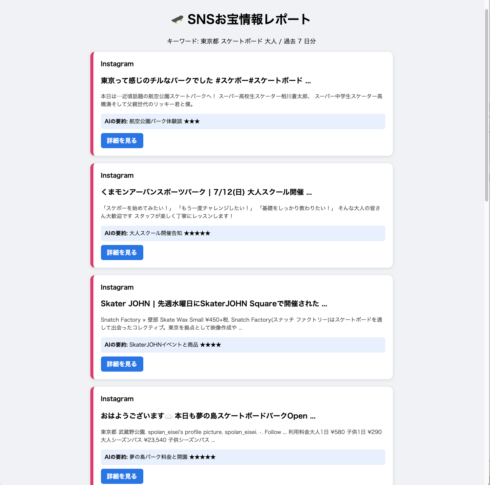

# sns_search

キーワードを入れるだけで X (Twitter) と Instagram から最新の投稿を集めて、
Google の Gemini AI が内容を判定・要約し、見やすい HTML レポートを自動で作るコマンドラインツールです。

「気になるジャンルの最新情報を、毎回SNSを何度も検索して回るのが面倒」
という悩みを、コマンド1発で解決するために作りました。

<!-- スクリーンショットを貼るとより伝わりやすくなります -->
<!--  -->


## できること

- キーワードを指定すると、X と Instagram を横断検索して直近◯日以内の投稿を集めます
- 各投稿を Google Gemini が読み取り、**信頼度 (★1〜5)** と **15文字の要約** を付けます
- 結果は色分けされた1ページの HTML レポートになり、既定のブラウザで自動的に開きます
- AI判定をスキップして検索だけ行うオプションもあります (`--no-classify`)


## 動作環境

このツールを動かすには、**Python**(パイソン)という無料のプログラミング言語がパソコンに入っている必要があります。

- Python 3.9 以上
- macOS / Windows / Linux (どの環境でも動作します)


## 準備するもの

インストールを始める前に、次の2つがパソコンに入っているかを確認します。

### 1. Python が入っているか確認

**Mac の場合**

「ターミナル」を開きます (Launchpad → 「その他」→「ターミナル」)。
黒い(または白い)画面が出たら、次の1行をコピーして貼り付け、Enter を押します。

```
python3 --version
```

`Python 3.9.x` のような表示が出れば OK です。

**Windows の場合**

キーボードの `Windows` キーを押して「cmd」と入力し、「コマンドプロンプト」を開きます。
次の1行をコピーして貼り付け、Enter を押します。

```
python --version
```

`Python 3.9.x` のような表示が出れば OK です。

**もし「command not found」や「認識されません」と出たら**

Python がまだ入っていないので、まず <https://www.python.org/downloads/> から最新の Python 3 をダウンロードしてインストールしてください。

> ⚠️ **Windows の場合の注意**: インストーラーの最初の画面で「**Add Python to PATH**」というチェックボックスに必ずチェックを入れてから進めてください。ここを忘れると、あとで `python` コマンドが使えず苦労します。

### 2. テキストエディタ

あとで `.env` という設定ファイルの中身を書き換えるのに使います。何を使ってもOKですが、迷ったら:

- **Mac**: 標準の「テキストエディット」でOK (または <https://code.visualstudio.com> から VS Code を無料で入れると便利)
- **Windows**: 標準の「メモ帳」でOK (または VS Code)


## インストール手順

### ステップ1: このリポジトリのコードをダウンロード

このページの上のほうにある、緑色の「**<> Code**」ボタンをクリックしてください。開いたメニューの下のほうに「**Download ZIP**」というリンクがあるので、それをクリックします。

`sns_search-main.zip` というファイルがダウンロードされます。**ダブルクリックで解凍**し、出てきた `sns_search-main` フォルダを、分かりやすい場所(例: デスクトップ)に置いてください。

> 💡 Git を使い慣れている人は、代わりに `git clone https://github.com/Masahiro-Gif2026/sns_search.git` でもOKです。

### ステップ2: そのフォルダに「移動」する

先ほど開いたターミナル(Mac)またはコマンドプロンプト(Windows)に戻り、次の1行を貼り付けて Enter を押します。

**Mac の場合**

```
cd ~/Desktop/sns_search-main
```

**Windows の場合**

```
cd %USERPROFILE%\Desktop\sns_search-main
```

> 💡 デスクトップ以外の場所に置いた場合は、上のコマンドの `~/Desktop/` または `%USERPROFILE%\Desktop\` を、実際に置いた場所に置き換えてください。

### ステップ3: 必要なライブラリをまとめてインストール

同じ画面で、次の1行を貼り付けて Enter を押します。

```
pip install -r requirements.txt
```

ダウンロードのメッセージが数十秒〜1分ほど流れます。最後に「**Successfully installed …**」のようなメッセージが出れば成功です。

> 💡 「pip: command not found」と出た場合は、`pip` の代わりに `pip3` を試してください。

### ステップ4: 環境変数ファイル(`.env`)を用意

`.env.example` というテンプレートをコピーして `.env` という名前のファイルを作ります。同じ画面で:

**Mac の場合**

```
cp .env.example .env
```

**Windows の場合**

```
copy .env.example .env
```

> 💡 コマンドが苦手なら、Finder(Mac)やエクスプローラー(Windows)で `.env.example` を複製して、コピーしたファイルの名前を `.env` に変更するだけでもOKです。

### ステップ5: `.env` を開いて、あなたのAPIキーを記入

作った `.env` ファイルを、テキストエディタで開きます(ファイルを右クリック →「開く」または「アプリケーションで開く」→ テキストエディット/メモ帳/VS Code を選ぶ)。

中身は次のようになっているはずです。

```
SERPER_API_KEY=your-serper-api-key-here
GEMINI_API_KEY=your-gemini-api-key-here
```

`your-serper-api-key-here` の部分を、次に取得する **Serper のキー** に、
`your-gemini-api-key-here` の部分を、次に取得する **Gemini のキー** に置き換えて、**上書き保存**してください。

キーの取り方は次のセクションで説明します。


## APIキーの取得

このツールを動かすには **Serper.dev** と **Google Gemini** の2つの無料APIキーが必要です。
どちらも数分で発行でき、無料枠だけで数ヶ月遊べます。

### 1. Serper.dev (SNS検索用)

1. <https://serper.dev> にアクセス
2. 「Get Started Free」からメールアドレスでアカウント作成 (クレジットカード不要)
3. ダッシュボードに表示される「API Key」をコピー
4. `.env` の `SERPER_API_KEY=` の右側に貼り付け

**無料枠**: 初回登録時に 2,500クレジット付与 (1検索で2クレジット消費 = 約1,250回分)

### 2. Google Gemini (AI要約用)

1. <https://aistudio.google.com/apikey> にアクセス (Google アカウントでログイン)
2. 「Create API key」をクリックしてキーを生成
3. 生成されたキーをコピー
4. `.env` の `GEMINI_API_KEY=` の右側に貼り付け

**無料枠**: 1日あたり 250〜1,500回まで無料 (個人利用なら十分)

> 💡 AIを使わずに検索だけ行いたい場合は、Gemini のキーはなくても構いません。
> その場合はコマンドに `--no-classify` を付けて実行してください。


## 使い方

### 基本

```bash
python sns_search.py "検索したいキーワード"
```

コマンドを実行すると、SNS検索 → AI判定 → HTMLレポート生成 が自動で走り、
`report.html` がブラウザで開きます。

### オプション

| オプション         | 説明                                                    | 例                 |
| ------------------ | ------------------------------------------------------- | ------------------ |
| `--days N`         | 直近 N 日以内の投稿だけを対象にする (既定: 7)           | `--days 14`        |
| `--no-classify`    | AI判定をスキップして検索だけ行う (Gemini キー不要)      | `--no-classify`    |

### 実行例

```bash
# スケートボード関連の投稿を過去7日ぶんチェック
python sns_search.py "スケートボード"

# 過去2週間ぶんの「無料講座」情報をチェック
python sns_search.py "無料講座" --days 14

# AIを使わず検索だけしたい
python sns_search.py "カメラ" --no-classify
```


## 出力について

- 実行フォルダに `report.html` が生成され、ブラウザで自動的に開きます
- 既存の `report.html` は毎回上書きされます (過去の結果を残したい場合はリネームしてください)
- レポートは1ページの静的HTMLなので、そのままメールに添付したり、社内で共有したりできます


## よくあるつまずき

**「モジュールが見つからない」というエラーが出る**
→ `pip install -r requirements.txt` を実行し忘れている可能性があります。

**「APIキーが正しくない」というエラーが出る**
→ `.env` の記載を確認してください。キーの前後にスペースや引用符が入っていないか、
`=` の直後に貼り付けているか、をチェックしてください。

**検索結果が0件になる**
→ 該当期間内に投稿が見つからなかった可能性があります。`--days` を大きくして試してください。

**AI要約が「AI判定スキップ」になる**
→ Gemini の1日の無料枠を使い切っている可能性があります。翌日以降に再試行してください。


## ライセンス

MIT License. 詳しくは [LICENSE](./LICENSE) をご覧ください。


## 作者

木村政弘 ([@Masahiro-Gif2026](https://github.com/Masahiro-Gif2026))

バグ報告や機能追加のリクエストは、GitHub の Issues でお気軽にどうぞ。
